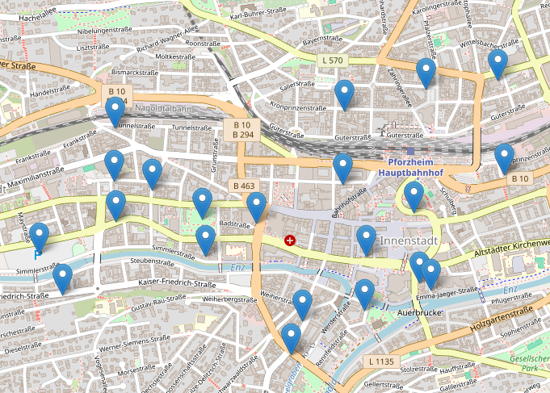

# Pforzheim Smart City - Sensor-Standort-Analyse 

Projekt: [https://www.smartcity-pforzheim.de/index.html]



## Beschreibung
In diesem Notebook analysieren wir die Standortdaten von Sensoren in Pforzheim. Ziel ist es, die Adressen der Sensoren zu bereinigen, problematische Daten zu identifizieren und eine visuelle Darstellung der Standorte auf einer interaktiven Karte zu erstellen.

## Inhalte des Notebooks
1. **Datenbereinigung**: 
   - Überprüfung und Bereinigung von Adressdaten.
   - Identifikation und Aussonderung fehlerhafter Einträge.

2. **Geokodierung**:
   - Umwandlung von Adressen in geografische Koordinaten (Breiten- und Längengrade) mithilfe des Nominatim-Dienstes.

3. **Visuelle Darstellung**:
   - Anzeige der bereinigten Standorte auf einer interaktiven Karte mit Folium.
  

## ToDo List

1. **Analyse problematischer Daten**: 
   - Erstellung eines separaten Datensatzes mit fehlerhaften Einträgen, die dem Produzenten zur Korrektur übergeben werden.


## Quick Start

### Clone Github Repository mit git

```bash
git clone <REPOSITORY_URL>.git
```
### Vituelleumgebung erzeugen
```python
python3 -m venv my_venv
```
### Vituelleumgebung aktivieren
```bash
source venv/bin/activate
```
### Packages in Vituelleumgebung instalieren
```python
pip install ipykernel 
pip insall -r requierments.txt
```
### (Optional) Vituelleumgebung deaktivieren
```bash
deactivate
```
